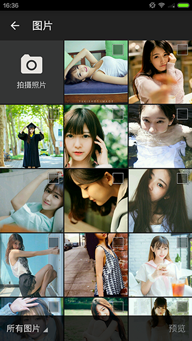
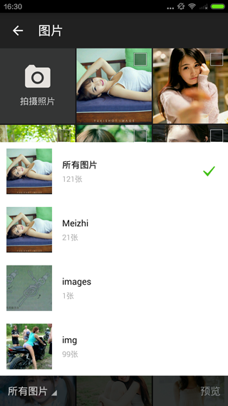
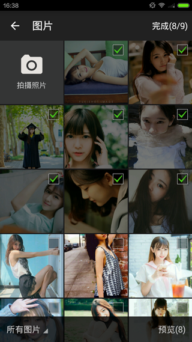

# PhotoPicker

基于 [donglua/PhotoPicker](https://github.com/donglua/PhotoPicker)、[lovetuzitong/MultiImageSelector](https://github.com/lovetuzitong/MultiImageSelector) 修改的一个图片选择类库。

## Gradle

    compile 'com.foamtrace:photopicker:1.0'

## 效果图





## 使用方法

### ImageConfig
可选属性， 用于过滤照片列表信息。

```java
ImageConfig config = new ImageConfig();
config.minHeight = 400;
config.minWidth = 400;
config.mimeType = new String[]{"image/jpeg", "image/png"}; // 图片类型 image/gif ...
config.minSize = 1 * 1024 * 1024; // 1Mb 图片大小
```

### 单选

```java
PhotoPickerIntent intent = new PhotoPickerIntent(MainActivity.this);
intent.setSelectModel(SelectModel.SINGLE);
intent.setShowCarema(true); // 是否显示拍照， 默认false
// intent.setImageConfig(config);
startActivityForResult(intent, REQUEST_CAMERA_CODE);
```

### 多选

```java
PhotoPickerIntent intent = new PhotoPickerIntent(MainActivity.this);
intent.setSelectModel(SelectModel.MULTI);
intent.setShowCarema(true); // 是否显示拍照， 默认false
intent.setMaxTotal(9); // 最多选择照片数量，默认为9
intent.setSelectedPaths(imagePaths); // 已选中的照片地址， 用于回显选中状态
// intent.setImageConfig(config);
startActivityForResult(intent, REQUEST_CAMERA_CODE);
```

### 拍照

```java

private ImageCaptureManager captureManager;

btnCarema.setOnClickListener(new View.OnClickListener() {
    @Override
    public void onClick(View v) {
        try {
            if(captureManager == null){
                captureManager = new ImageCaptureManager(MainActivity.this);
            }
            Intent intent = captureManager.dispatchTakePictureIntent();
            startActivityForResult(intent, ImageCaptureManager.REQUEST_TAKE_PHOTO);
        } catch (IOException e) {
            Toast.makeText(MainActivity.this, R.string.msg_no_camera, Toast.LENGTH_SHORT).show();
            e.printStackTrace();
        }
    }
});
```

### 预览

```java
PhotoPreviewIntent intent = new PhotoPreviewIntent(MainActivity.this);
intent.setCurrentItem(position); // 当前选中照片的下标
intent.setPhotoPaths(imagePaths); // 已选中的照片地址
startActivityForResult(intent, REQUEST_PREVIEW_CODE);
```

### ActivityResult

```java
@Override
protected void onActivityResult(int requestCode, int resultCode, Intent data) {
    super.onActivityResult(requestCode, resultCode, data);
    if(resultCode == RESULT_OK) {
        switch (requestCode) {
            // 选择照片
            case REQUEST_CAMERA_CODE:
                refreshAdpater(data.getStringArrayListExtra(PhotoPickerActivity.EXTRA_RESULT));
                break;
            // 拍照
            case ImageCaptureManager.REQUEST_TAKE_PHOTO:
                if(captureManager.getCurrentPhotoPath() != null) {
                    captureManager.galleryAddPic();
                    // 照片地址
                    String imagePaht = captureManager.getCurrentPhotoPath();
                    // ...
                }
                break;
            // 预览
            case REQUEST_PREVIEW_CODE:
                refreshAdpater(data.getStringArrayListExtra(PhotoPreviewActivity.EXTRA_RESULT));
                break;
        }
    }
}

private void refreshAdpater(ArrayList<String> paths){
    // 处理返回照片地址
}
```

## 配置信息

### style.xml

```xml
<!-- 设置ActionBar菜单字体 -->
<style name="ActionMenuTextStyle" parent="TextAppearance.AppCompat.Widget.ActionBar.Menu">
    <item name="android:textSize">@dimen/action_text_size</item>
    <item name="android:textStyle">normal</item>
</style>

<style name="actionBarTheme" parent="ThemeOverlay.AppCompat.Dark.ActionBar">
</style>

<style name="actionBarPopupTheme" parent="ThemeOverlay.AppCompat.Light">
</style>

<style name="PhotoPickerTheme" parent="Theme.AppCompat.Light.DarkActionBar">
    <item name="windowActionBar">false</item>
    <item name="windowNoTitle">true</item>
    <item name="android:windowBackground">@color/photopicker_background</item>
    <item name="actionMenuTextAppearance">@style/ActionMenuTextStyle</item>
    <!--<item name="actionBarTheme">@style/actionBarTheme</item>-->
    <!--<item name="actionBarPopupTheme">@style/actionBarPopupTheme</item>-->
</style>
```

### AndroidManifest.xml

```xml
<activity
    android:name="com.foamtrace.photopicker.PhotoPickerActivity"
    android:theme="@style/PhotoPickerTheme"
    android:configChanges="orientation|screenSize"/>

<activity android:name="com.foamtrace.photopicker.PhotoPreviewActivity"
    android:theme="@style/PhotoPickerTheme"/>
```
